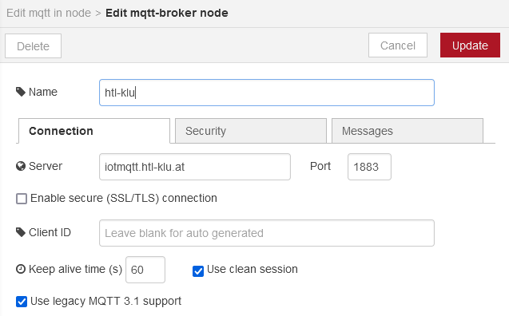

# 3AHEL-Theorie-SYS

**table of content**
- [3AHEL-Theorie-SYS](#3ahel-theorie-sys)
  - [MQTT](#mqtt)
    - [In der Schule:](#in-der-schule)
    - [Topics:](#topics)
      - [Für Daheim:](#für-daheim)
  - [Node RED:](#node-red)
    - [Install at Home:](#install-at-home)
      - [Windows:](#windows)
    - [School:](#school)
    - [Server config:](#server-config)
    - [Server save:](#server-save)
  - [Linux:](#linux)
    - [Was ist Linux:](#was-ist-linux)
    - [Starten von Linux:](#starten-von-linux)
___
## MQTT

https://blog.doubleslash.de/mqtt-fuer-dummies/

### In der Schule:
MQTT Broker: iotmqtt.htl-klu.at 
Username: htl-IoT 
Password: iot..2015 
Port: 1883 

 

### Topics: 
Hierachie - bei uns in der Schule  
htl/3xhel/Name/# - gibt alle daten von allen Topics von dieser klasse an. 

#### Für Daheim: 
http://mqtt-explorer.com/ ->portable exe
 

Topic htl/3ahel/#

 
Der mqttexplorer 
U:\Programme\iot\tools
 
 

___
## Node RED: 
### Install at Home:
  https://nodered.org/docs/getting-started/
  #### Windows:
  https://nodered.org/docs/getting-started/windows

### School:
Schule: AlleProgramme\Mikrocontroller\Node-RED 
1. Coppy server IP address paste it to your browser

### Server config:

### Server save:
1. alles koppieren
2. rechts oben: Export -> clipboard
3. STRG + C

___
## Linux:
### Was ist Linux:
### Starten von Linux:
cmd: `docker run -it ubuntu`   
Aktuelles verzeichnis aufrufen: `ls`  
Verzeichnis wechseln: `cd` change Directory 
Verzeichnis erstellen: `mkdir` make Directory  
Wichtig!! Linux ist case sensitiv(Groß, Kleinschreibung sind wichtig)  
