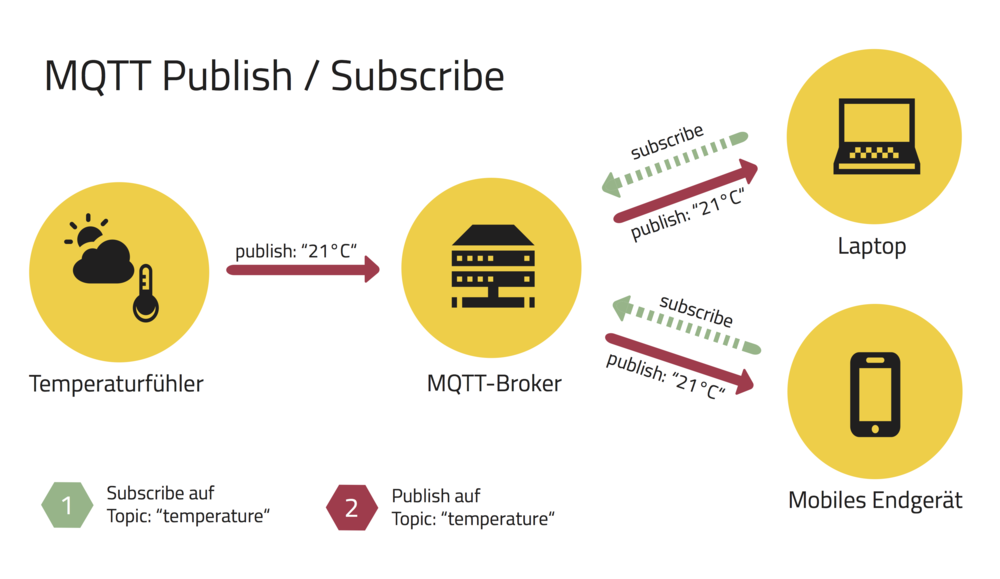

# 3AHEL-Theorie-SYS

**table of content**
1. [MQTT](#MQTT)
___
## MQTT

https://blog.doubleslash.de/mqtt-fuer-dummies/

In der Schule: 
MQTT Broker: iotmqtt.htl-klu.at 
Username: htl-IoT 
Password: iot..2015 

 

Topics: 
Hierachie - bei uns in der SCule  
htl/3xhel/Name/# - gibt alle daten von allen Topics von dieser klasse an. 
 

Topic htl/3ahel/#

 
Der mqttexplorer 
U:\Programme\iot\tools

 

Für Daheim: http://